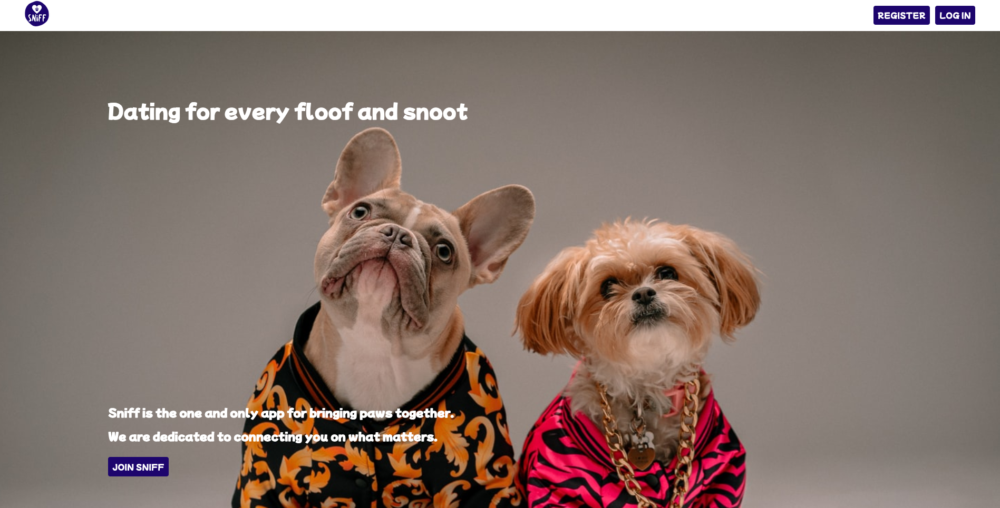
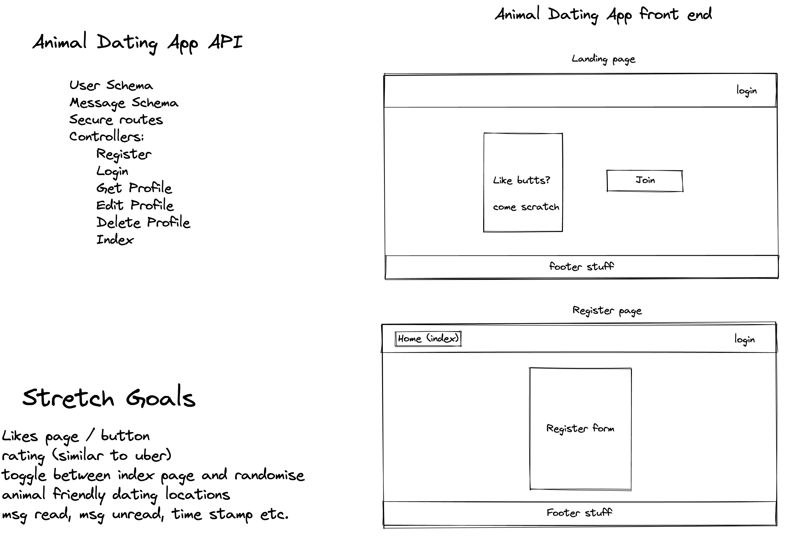
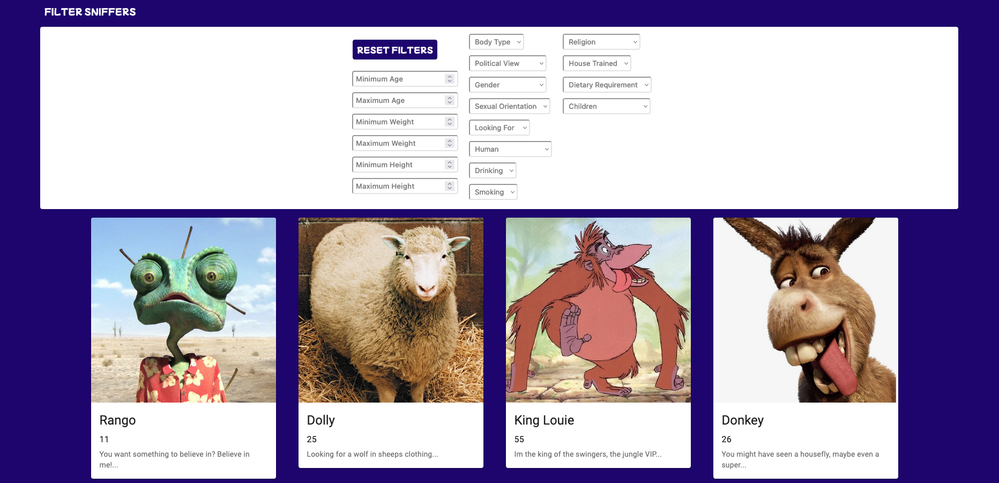
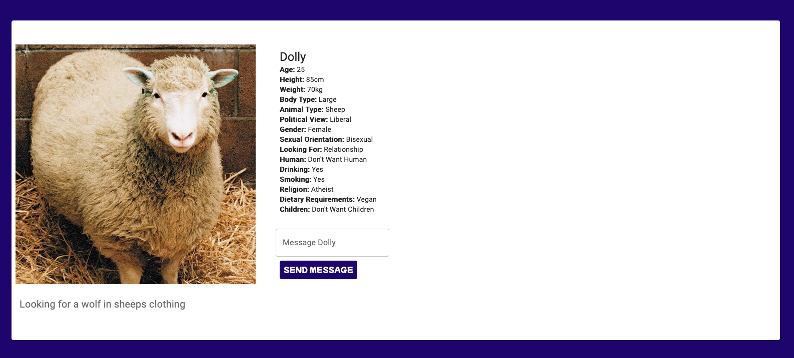
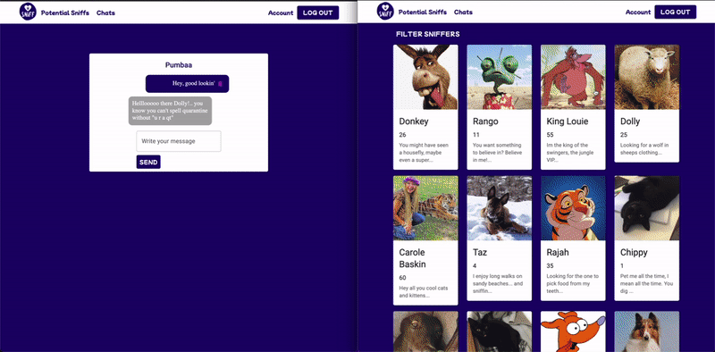

# Project 3 - Sniff
## Overview
This project was the third and first full-stack project of the General Assembly Software Engineering Immersive Course. This was a group project, done in a group of 3 and lasted one week. As a group, we chose to create a dating website for animals called 'Sniff'

## Brief
The brief was to create a full-stack application by creating our own backend and frontend
### Technical Requirements
* Use an Express API to serve your data from a Mongo database
* Consume your API with a separate frontend built with React
* Have a complete product with multiple relationships and CRUD functionality and have multiple models

## Collaborators
* [Esin Yilmazbilek](https://github.com/EsinYilmazbilek)
* [Joe Freeman](https://github.com/joefreeman8)

## Built With
* Express
* Node.js
* Mongoose
* MongoDB
* Insomnia
* React.js
* JSX
* CSS
* SASS
* MUI Framework
* Axios
* React-Router-DOM
* Hamburger React
* Git
* GitHub

## Key Features
### Minimum Requirements
* User schema and ability to create a user profile
* Message schema and ability to message other users
* Edit and delete user profile

### Stretch Goals
* Delete messages and chats
* Like button
* Rating of profiles

## Deployed Version
Since Heroku have stopped their free subscription the back end of the project is no longer supported unfortunately however the project can still be run on local server.
[View the deployed version of the app](https://sniff.netlify.app/)

You may use the following credentials to sign in:
* Email: willowtree@email
* Password: pass

## Planning
Our first stage of planning was deciding what app we wanted to create as we were given free reign for this. We quickly realised we had a mutual love for pets and animals and we also wanted to push ourselves and create something new which we hadn't done before, such as a dating app so we just combined the two.

We were able to work well together and bounce ideas to come up with an initial plan and put everything in an Excalidraw:

We decided that we wanted to all work on as many components as we could, especially aspects that were new to us all therefore we all acted as full-stack engineers for this project.

As a team, we split up the backend components in order to work through them as quickly as possible and once that was up and running we focused on the frontend.

## The Build
Throughout the projects we had daily stand-ups to check in on what everyone was working on and help eachother with any bugs or issues. We also stayed on a Zoom call all day while working in order to keep open communication and support eachother as well as using Slack to share code snippets.

We used branches to code individually and throughout the day would have multiple 'mergefests' where we would take turns merging to the main branch and pushing so that we would all have the most up-to-date code.

## Work Split
Back-End:
* Alex - Schema and Error Handling
* Esin - Controllers
* Joe - Enviroment, Router and Database of registered users

Front-End:
* Alex - Index Page, Profile Show Page, Chat
* Esin - NavBar, Home Page, Chat
* Joe - Register, Login, Edit Profile, Chat

## Backend
When working on the backend, we each started working on our assigned elements while on a Zoom call so we could provide support when needed.

My main focus was creating the two Schemas, one for the user profiles and one for the chat history. I used Mongoose Schema to build these and used Mongoose unique validator for pre-save validation within the Mongoose schemas and bcrypt to encrypt user passwords.:
```js
const userSchema = new mongoose.Schema({
  email: { type: String, unique: true, required: true },
  password: { type: String, required: true },
  name: { type: String, required: true },
  picture: { type: String },
  elevatorPitch: { type: String, required: true, maxlength: 140 },
  age: { type: Number, required: true },
  height: { type: Number },
  weight: { type: Number },
  bodyType: { type: String },
  animalType: { type: String, required: true },
  politicalView: { type: String },
  gender: { type: String },
  sexualOrientation: { type: String },
  lookingFor: [{ type: String, required: true }],
  human: { type: String },
  drinking: { type: Boolean },
  smoking: { type: Boolean },
  religion: { type: String },
  houseTrained: { type: Boolean },
  dietaryRequirements: [{ type: String }],
  children: { type: String },
})

userSchema.set('toJSON', {
  transform(_doc, json) {
    delete json.password
    return json
  },
})

userSchema.virtual('passwordConfirmation').set(function (passwordConfirmation) {
  this._passwordConfirmation = passwordConfirmation
})

userSchema.pre('validate', function (next) {
  if (
    this.isModified('password') &&
    this.password !== this._passwordConfirmation
  ) {
    this.invalidate('passwordConfirmation', 'does not match')
  }
  next()
})

userSchema.pre('save', function (next) {
  if (this.isModified('password')) {
    this.password = bcrypt.hashSync(this.password, bcrypt.genSaltSync())
  }
  next()
})

userSchema.methods.validatePassword = function (password) {
  return bcrypt.compareSync(password, this.password)
}


userSchema.plugin(mongooseUniqueValidator)

export default mongoose.model('User', userSchema)
```

While the user model was quite straight forward, the chat model was slightly more complicated. I quickly realised that two schemas would be needed for it to work, one named ```chatSchema``` to store the user information and nested within a ```messages``` key, I created an array with a second ```messagesSchema``` where the individuals messages between those two users would be stored. This enabled us to allow individual messages to be deleted on the frontend, without having to delete the entire chat.
```js
const messageSchema = new mongoose.Schema({
  text: { type: String, required: true },
  sender: { type: String, required: true },
  receiver: { type: String, required: true },
},{
  timestamps: true,
})

const chatSchema = new mongoose.Schema({
  messages: [messageSchema],
  userOne: { type: mongoose.Schema.ObjectId, ref: 'User', required: true },
  userTwo: { type: mongoose.Schema.ObjectId, ref: 'User', required: true },
})
```

Once I created the the required schemas, I was able to pick up any unfinished work that my teammates hadn't gotten to yet. I focused on improving our error handling both for user experience but also, more importantly, for the frontend engineer. I concluded that there would be two main errors, one if the user is unauthorised to perform the action and one if the item is not found:
```js
export class NotFound extends Error {
  constructor() {
    super()

    this.name = 'NotFound'
  }
}

export class Unauthorized extends Error {
  constructor() {
    super()

    this.name = 'Unauthorized'
  }
}
```

Once we all finished our assigned tasks and our data was seeded, we checked all our endpoints on Insomnia to ensure our backend was running properly. We were able to finish our entire backend in just one day, which surpassed our expectations or timeline and with that we started on the frontend on day 2 of the project.

## Frontend
When tackling the frontend, we broke it up into components which needed to be completed and allocated each component to a team member. The chat feature was something new to all of us so we decided to work on that together as an educational experience for everyone.

The two main components I worked on were the Index Page which would display all the user profiles and the Profile Show Page which is a display of a specific user profile.
### Index Page
When creating the index page, I used the MUI Card component and the Grid component to display the profile image, name, age and blurb in a grid. While this was a quick task, the most challenging aspect was the extensive filtering we wanted to impliment, as wanted the user to be able to filter the users using multiple attributes at the same time. The below code allowed us to do this and I am personally quite proud of it as I managed to code it by myself:
```js
const filterProfiles = (profiles) => {
    return profiles.filter(profile => {
      return (
        profile._id !== currentUserId) &&
        (profile.age >= ageMinValue || ageMinValue === null) &&
        (profile.age <= ageMaxValue || ageMaxValue === null) &&
        (profile.weight >= weightMinValue || weightMinValue === null) &&
        (profile.weight <= weightMaxValue || weightMaxValue === null) &&
        (profile.height >= heightMinValue || heightMinValue === null) &&
        (profile.height <= heightMaxValue || heightMaxValue === null) &&
        (profile.bodyType?.includes(bodyTypeValue) || bodyTypeValue === '') &&
        (profile.politicalView?.includes(politicalViewValue) || politicalViewValue === '') &&
        (profile.gender?.includes(genderValue) || genderValue === '') &&
        (profile.sexualOrientation?.includes(sexualOrientationValue) || sexualOrientationValue === '') &&
        (profile.lookingFor?.includes(lookingForValue) || lookingForValue === '') &&
        (profile.human?.includes(humanValue) || humanValue === '') &&
        (String(profile.drinking)?.includes(drinkingValue) || drinkingValue === null) &&
        (String(profile.smoking)?.includes(smokingValue) || smokingValue === null) &&
        (profile.religion?.includes(religionValue) || religionValue === '') &&
        (String(profile.houseTrained)?.includes(houseTrainedValue) || houseTrainedValue === null) &&
        (profile.dietaryRequirements?.includes(dietaryRequirementsValue) || dietaryRequirementsValue === '') &&
        (profile.children?.includes(childrenValue) || childrenValue === '')
    })
  }
```

### Profile Show Page
The profile show page is a simple display page for all the information in a user's profile. Using props I was able to to direct the user to the correct profile, once they clicked on it from the index page.

The most complex aspect of this page, was the conditional formatting on the messaging feature embeded into the page. Using the logged in used ID from local storage, the used ID of the viewed profile and the chat history pulled from the backend we were able to determine whether the two users have chatted before. If they have chatted before clicking the 'message' button takes the user directly to their chat and displays the chat history. If they haven't, a chatbox opens up on the profile show page where they can initiate a conversation from there. The below code snippet allows this function:
```js
const handleMessageButtonClick = () => {
    if (
      chats.length > 0
    ) {
      console.log('here')
      navigate(`/chat/${chats[0]._id}`)
    } else {
      setIsMessaging(true)
      console.log('there')
    }
  }
```


### Chat Feature
The most challenging aspect of this project was the Chat Feature. We used ```useEffect``` to set our chat data into state. One challenge was distinguishing which user was sending each message and which user was receiving it. Thankfully, we had anticipated this and in our schema, for each message sent we added both the sent user ID and the received user ID. The below code snippet allowed this to be displayed on the frontend:
```js
const [sender, setSender] = React.useState(null)
  const [chat, setChat] = React.useState(null)
  const [userId, setUserId] = React.useState('')
  const currentUserId = JSON.parse(localStorage.getItem('userId'))

  React.useEffect(() => {
    const getData = async () => {
      try {
        const senderData = await getSingleProfile(userId)
        setSender(senderData.data)
        const chatData = await getSingleChat(chatId)
        setChat(chatData.data)
        if (chatObject.userOne !== currentUserId) {
          return setUserId(chatObject.userOne)
        } else {
          return setUserId(chatObject.userTwo)
        }
      } catch (err) {
        console.log(err)
      }
    }
    getData()
  }, [userId, chatId, chatObject.userOne, chatObject.userTwo, currentUserId])
```
Another challenge we faced with the chat feature was making it appear as if the conversation was 'live', meaning messages would appear instantaneously without having to refresh the page. We overcame this by using a ```setInterval``` which pulled the data every 500ms:
```js
const interval = setInterval(getData, 500)
```

When we were getting somewhere with the chat feature and were quite pleased with it, we once again found another issue. We wanted the user to be able to delete their own messages, which we were able to do using the userID stored in Local Storage matching the userID of the message. However, we realised that once all messages in a chat were deleted, the chat itself still remained and appeared empty in out chats index page. Thankfully, using an 'if statement' I was able to check whether the length of the chat array was zero or not every time a message in that chat was deleted, and if it was, the chat itself would delete. This meant that we had to go back to the backend and create a ```chatDelete``` controller and using the below code in the frontend we were able to achieve this to improve user experience:
```js
  const handleDelete = async () => {
    if (window.confirm('Do you want to delete this message?')) {
      try {
        await deleteMessage(chatId, singleMessage._id)
        const { data } = await getSingleChat(chatId)
        if (data.messages.length === 0) {
          await deleteChat(chatId)
          navigate('/chat')
        } else {
          setAllMessages(data.messages)
        }
      } catch (err) {
        console.log(err)
      }
    }
  }
```
### Front-End Features to Improve User Experience
#### Profile Edit/Delete
We wanted to give the user the option to edit and delete their profile. Joe worked on building the edit form and used state to pre-populate the form with the user's pre-existing profile information.

Using state we were also able to delete the user's messages when they delete their profile, in order to abide by data protection. We stored their chat history in state when they would load their profile page so that this feature would be ready to go as soon as the user decided to delete.
### Registration Redirect
One feature that was quite important to us (and proved more challenging than expected) was logging in the user as soon as they register, rather than redirecting them to the login page so they then have to log in themselves. The most challenging aspect of this was retrieving the data from the backend as soon as it is created, as we couldn't source the userID from the form itself and this needed to be stored in Local Storage for our chat feature to work. We were able to go around this by retrieving all profile data once the user is registered, and then filtering through that using the user's email to fine the appropriate user ID, all within our ```handleSubmit``` function as shown below:
```js
 const handleSubmit = async (e) => {
  e.preventDefault()
  try {
    await registerUser(formData)
    const allProfiles = await getAllProfiles()
    const res = await loginUser(loginFormData)
    setToken(res.data.token)
    const userId = allProfiles.data.find(profile => {
      if (profile.email === formData.email) {
        return profile
      } else return
    })._id
    localStorage.setItem('userId', JSON.stringify(userId))
    navigate(`/account/${userId}/edit`)
  } catch (err) {
    setIsError(err)
  }
}
```
## Key Learnings
* One of biggest takeaways for me working on the first group project, was the importance of merging our code multiple times a day. This led to less conflicts when merging and thus we would waste less time trying to resolve them.
* Creating the chat feature was a huge learning experience for me as this was uncharted territory. I learned the importance of flexibility with your backend and that you will often have to go back and make changes to it as you build the frontend.
* The biggest takeaway was definitely the importance of having open communication and collaboration with your teammates as well as daily stand ups.
* I have to say, I really enjoyed working on this project with Esin and Joe and it was probably the project where I learned as a coded the most.

## Future Improvements
* Mobile friendly/responsive design
* Timestamp and 'read' feature on messages
* Further error handling
* Improve the home page design
* Ability to like and rate profiles